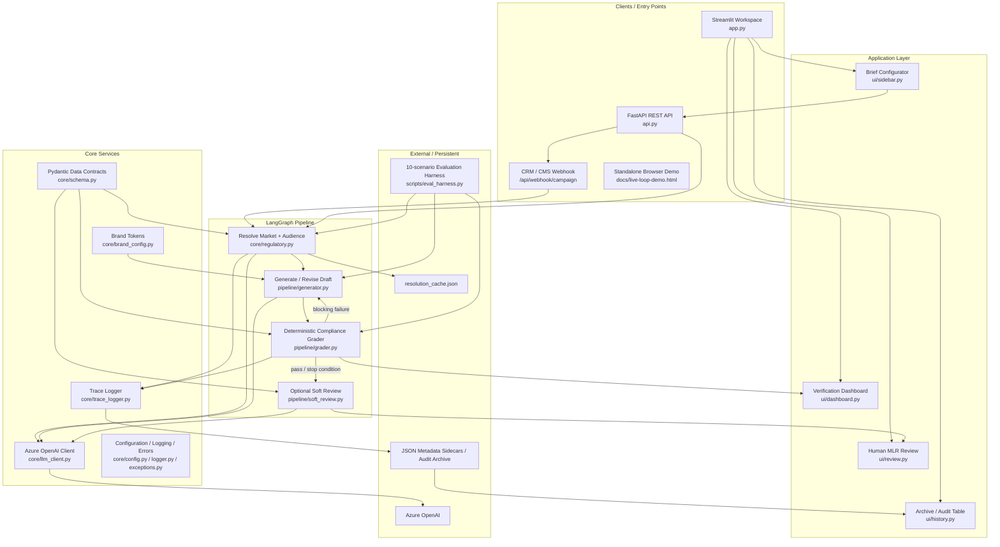
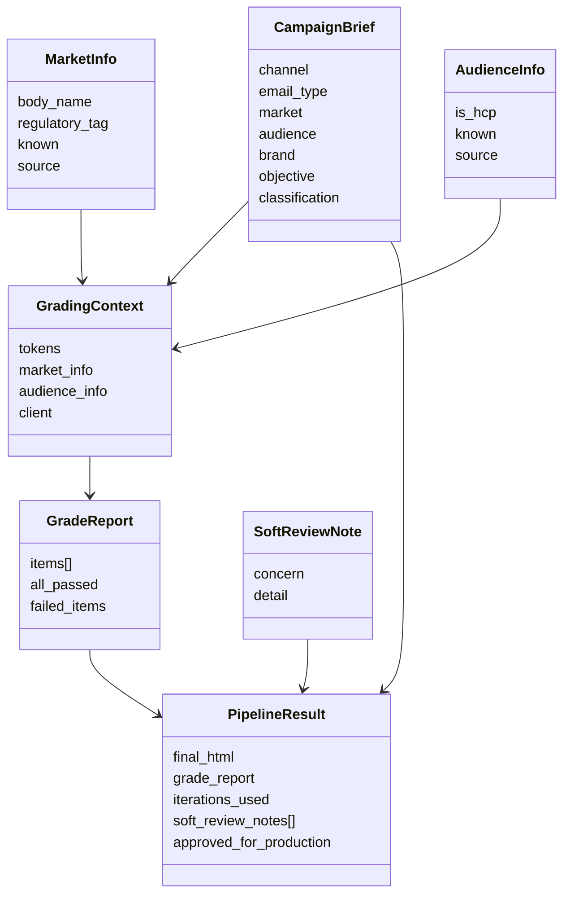
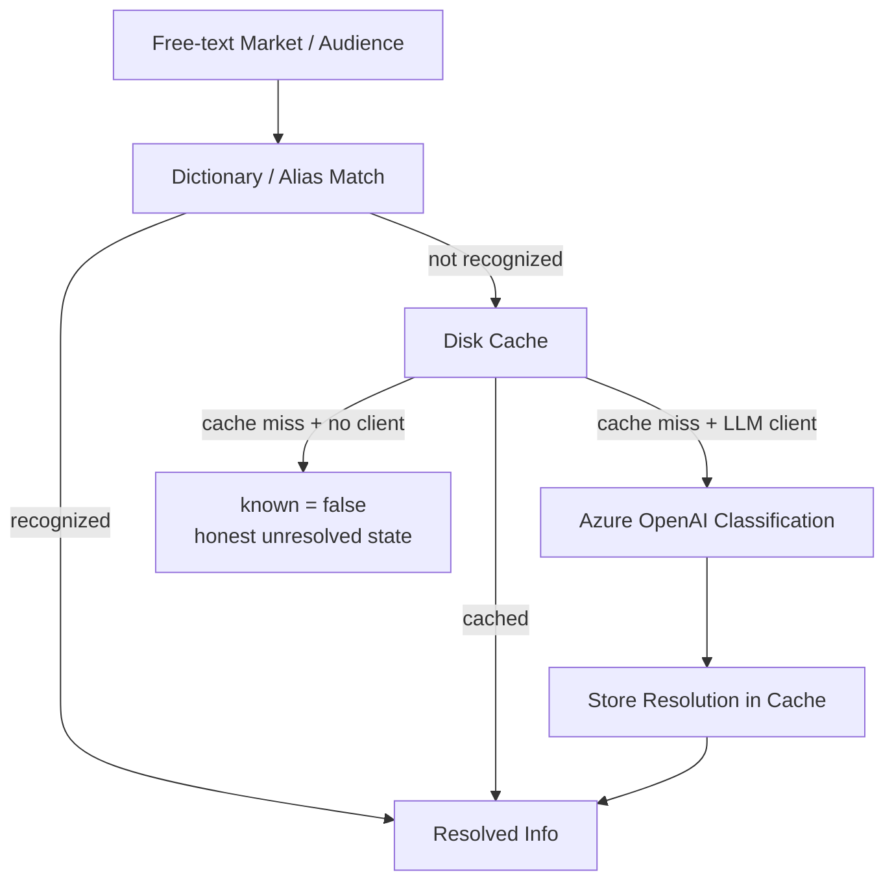
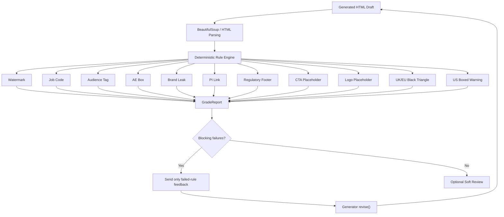
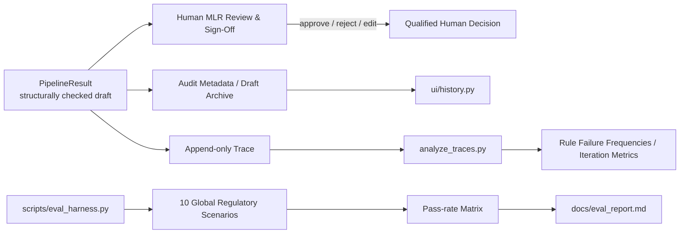
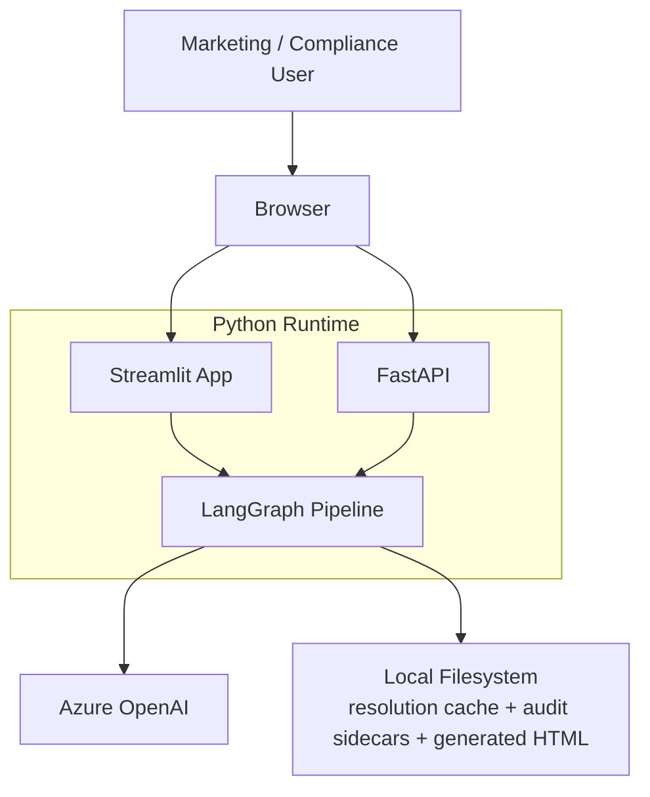

# Pharma Marketing MLR Compliance — Architecture Diagrams

These diagrams reflect the current repository architecture. The production runtime is the LangGraph pipeline used by both `app.py` and `api.py`; `pipeline/pipeline.py` remains a plain-Python reference implementation.

## 1. High-Level System Architecture



## 2. LangGraph Processing / Revision Loop

```mermaid
flowchart LR
    A["CampaignBrief"] --> B["resolve"]
    B --> C["generate\nIteration 1"]
    C --> D["grade\nDeterministic rules"]

    D --> E{Decision}

    E -->|All blocking rules pass| F["soft_review\nOptional advisory LLM"]
    E -->|Blocking failure\niterations < MAX| C
    E -->|Same failures repeated\n(stuck)| F
    E -->|MAX_ITERATIONS reached| F

    F --> G["PipelineResult\napproved_for_production = false"]

    C -.->|"revision uses previous HTML + failed rules"| C
    D -.->|"log_iteration()"| H["Trace Log"]
    B -.->|"log_resolution()"| H
```

### Pipeline state



## 3. Regulatory Resolution Strategy



## 4. Compliance Grading Architecture



## 5. Human Review, Audit and Evaluation



## 6. Deployment / Runtime View



## Architecture Notes

- `pipeline/pipeline_langgraph.py` is the runtime orchestrator. Its graph is `resolve → generate → grade → conditional generate/soft_review → END`.
- `pipeline/grader.py` is intentionally deterministic; the soft-review LLM is advisory and runs only after blocking checks pass.
- `PipelineResult.approved_for_production` is always `False`; the final regulatory decision remains human.
- Azure OpenAI is the only configured LLM provider.
- The plain-Python `pipeline/pipeline.py` mirrors the same core logic and is retained as a simpler reference implementation.
